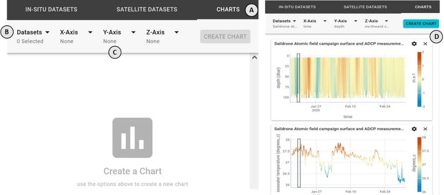
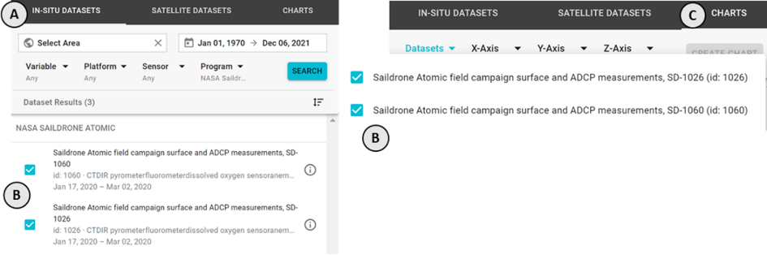
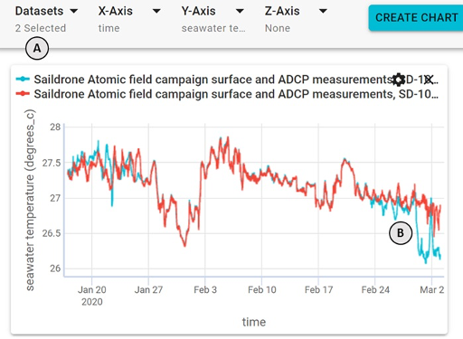
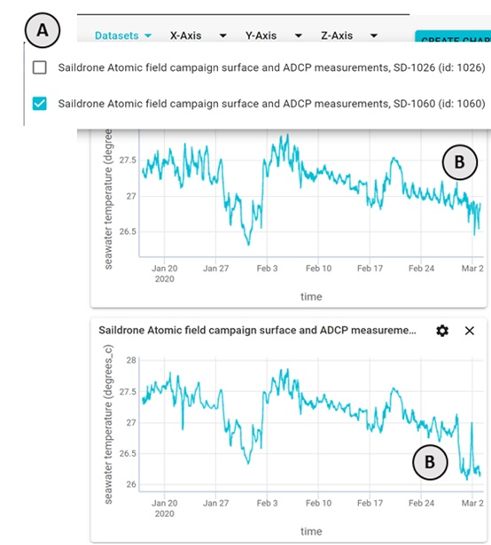
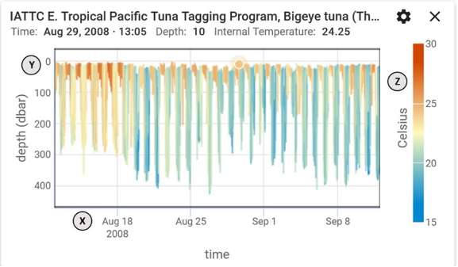
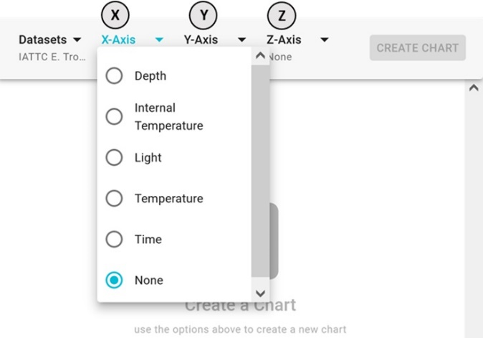

### How do I create a chart of this in-situ dataset?

Under the **CHARTS** tab of the main menu **(A)** on the right side of the application, use four dropdowns to select your dataset(s) **(B)**, x-axis variable, y-axis variable, and z-axis variable (optional) **(C)**, then click **CREATE CHART** **(D)**. The application will then fetch the data and plot it on the newly created chart.

_NOTE: depending on the quantity and extent of the selected data variable series for plotting, initial download and display may take a moment to complete. Subsequent display of the data series, however, will be rapid._

### Why aren't there any datasets under the datasets dropdown?

You must first select at least one in-situ dataset **(B)** from the **IN-SITU DATASETS** tab **(A)**. Any in-situ datasets you have selected will appear in the **Datasets** drop down **(B)** of the **CHARTS** tab panel **(C)**.

### Can I plot multiple datasets at once?

Yes, there are a couple ways to do this.

1.  Select multiple datasets from the **Datasets** dropdown **(A)** at the top of the **CHARTS** tab. When you create the chart, each of the selected datasets will be plotted on the same chart **(B)** sharing common X, Y, and Z axis variable selections.

2.  Create multiple charts each with a different dataset selected. Using the **Datasets** dropdown **(A)**, you can select a single dataset and create a chart. Then use the dropdown again to de-select the previous dataset and select another one, hit **CREATE CHART** again. This will produce a second chart listed above the first chart **(B)**. Repeat for as many charts as you like.

_NOTE: This same process can be useful to chart multiple variable combinations of the same dataset._

### What is the x, y, and z axes on the charts?

The `x` is horizontal axis, the `y` is the vertical axis, and `z` is represented by a coloring the plotted points.

### What parameters can I plot on the chart?

If you selected a single dataset to chart you can select any of the parameters that dataset contains on any of the x, y, or z axis. The exception to this is **Time** which can only be charted on the `x` axis.

### How many charts can I create?

There is no limit to the number of charts you can create. However, the URL may limit the number of charts that will be recreated if you share it.

### Can I create a chart of satellite data?

Not at this time, though we hope to support this in the future.
