### How can I change display settings on a chart?

Changes to the X-axis range is controlled by interactively zooming into areas of the chart by clicking and dragging horizontally over the chart features of interest. Y-axis range and all other plot settings can be adjusted via the chart settings menu. Click on **gear** icon **(A)** in the upper right corner of a chart to open the chart settings. Use the options in the popover to adjust the axis bounds **(B, C)**, invert the Y-axis **(D)** and more. If the chart uses _Time_ on the X-axis you can sync the X-axis range to the current date interval step **(E)**, and use the dropdown selection to switch between line/dot display of the chart data **(F)**. You can also adjust the downsampling target **(G)**. Once you have selected the display options you want, press **APPLY** in the upper right corner of the popover **(H)** to apply the options to the chart or click **RESET** to restore prior/default options.

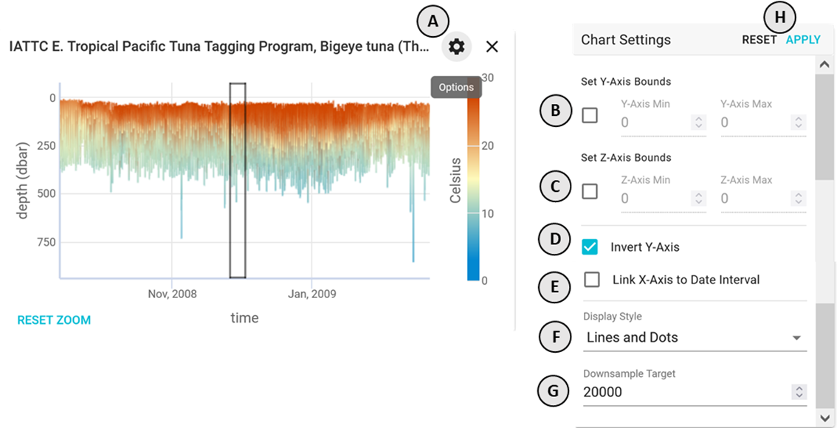

### How can I set the x-axis bounds on a chart?

Click and drag horizontally (left to right or right to left) on a chart to select a subset of the data range **(A)**. The chart will zoom into that section and fetch higher resolution data within the new bounds. Use the **RESET ZOOM** button in the lower left of the chart **(B)** to reset the horizontal bounds of the chart to the full temporal extent of the selected dataset(s).

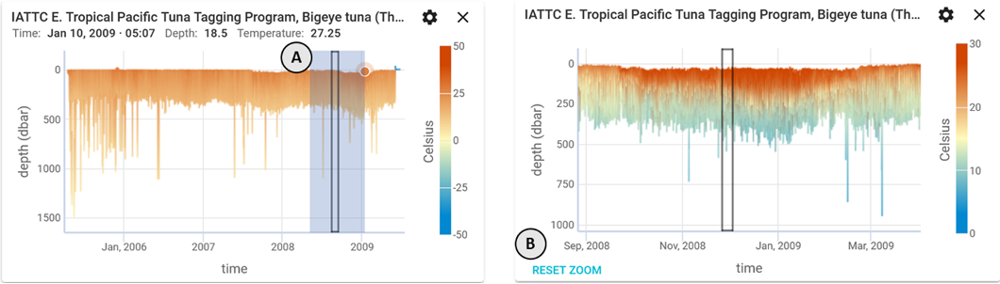

To have a chart automatically display just the data for the current time step within the chart window (D), click on the chart settings **gear** icon and check the **Link X-Axis to Date Interval** option **(C)**. Deselecting this checkbox setting unlinks the X-axis from the _current date interval_. Click **RESET ZOOM** to reset the X-axis to its full extent and once again view the complete time series and outlined black box for the current time interval.

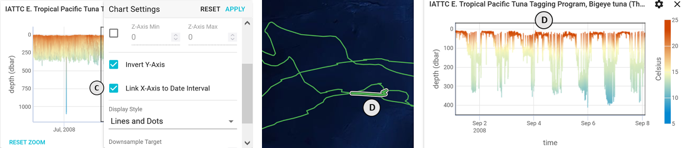

### How can I set the y-axis bounds on a chart?

Click on **gear** icon **(A)** in the upper right corner of a chart to open the chart settings popover. Use the **Set Y-Axis Bounds** inputs to set the vertical bounds you want **(B)**. In addition to Y-axis minima and maxima, there is also a toggle to invert the Y-axis values **(C)**. By default, this checkbox option is set to on for Depth data. Once entered, click **APPLY** in the upper right of the popover for the changes to take effect or **RESET** to revert to default settings. By default, the Y-axis scale will reflect the full range of values for the charted dataset(s).

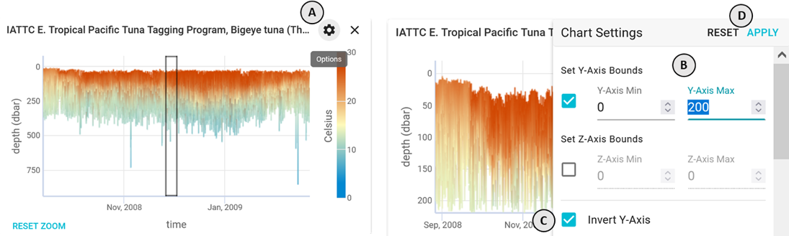

### How can I set the z-axis bounds on a chart?

Click on **gear** icon in the upper right corner of a chart **(A)** to open the chart settings popover. Use the **Set Z-Axis Bounds** inputs **(B)** to set the axis bounds you want. Once entered, click **APPLY** in the upper right of the popover **(C)**. The Z-axis color scale and charted values will be updated to reflect the minimum and maximum values set as opposed to the default full value range. Click **RESET** to revert to default values.

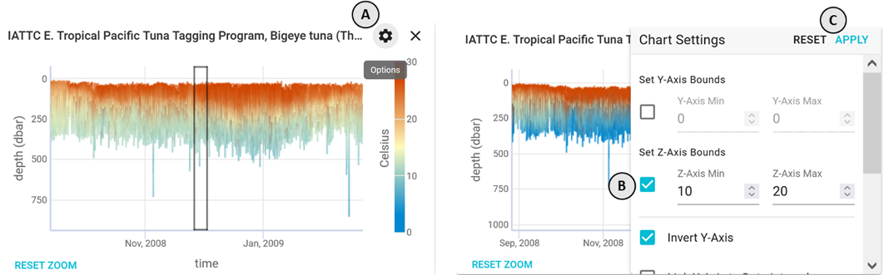

### Do the charts show all of the data from a dataset?

Yes, but it is downsampled to maximize efficiency for the current display bounds. When a chart is created, the x-axis range defaults to the minimum and maximum of the selected parameter's range from the dataset, we then use the Largest Triangle Three Bucket (LTTB) algorithm to downsample the points that are plotted on the chart between those bounds.

This algorithm preserves both the average and outlier points without displaying duplicate points. This means that the shape of the chart will accurately show the shape the full dataset while only displaying a subset of the data points which means the chart can be rendered more quickly. When the x-axis bounds are adjusted (see above) the downsampling will be re-calculated using the new bounds. The target number of points the downsampling attempts to achieve defaults to 20,000 points and can be adjusted in the display settings (see below). If the number data points within the current bounds prior to downsampling is less than or equal to the current downsampling target, then no downsampling will occur.

This means that from a high level you can see the shape of the entire dataset, and then "zoom in" to smaller and smaller bounds until you get to the non-downsampled individual data points for the entire series.

To adjust the amount of downsampling, click on the **gear** icon **(A)** in the upper right corner of a chart to open the chart settings popover. Modify the value in the **Downsample Target** field (B) as necessary.

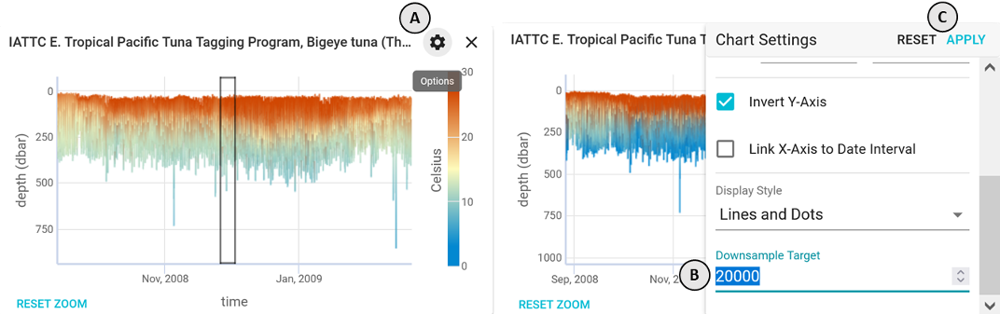

Increasing this value will include more points (with some potential download/rendering performance implications) whereas decreasing this value will include less points in the charted series. The effect of this setting on chart output quality (point density) is shown in the figure below for downsampling target value settings of A) 20,000 (default), B) 300, and C) 40,000 respectively. Series length and zoom level are factors modulating chart point density and series appearance for any given downsampling value setting.

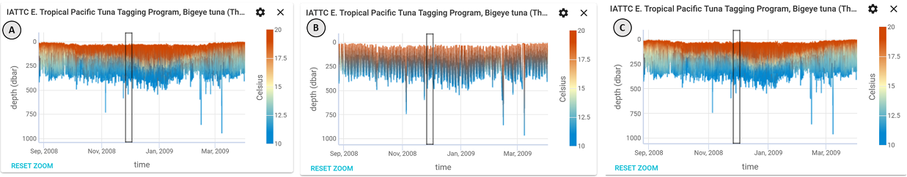

### How can I chart data continuously just for the current time interval?

To have a chart automatically display just the data fro the _current time step_ within the chart window **(B)** and associated mapped trajectory bold line segment, click on the **gear** icon to open the chart settings and select **Link X-Axis to Date Interval** **(A)** and then click **APPLY**. Deselecting this checkbox setting unlinks the X-axis from teh _current date interval_. Click **RESET ZOOM** **(C)** to reset the X-axis to its full extent and once again view the complete time series and outlined black box for the current time interval.

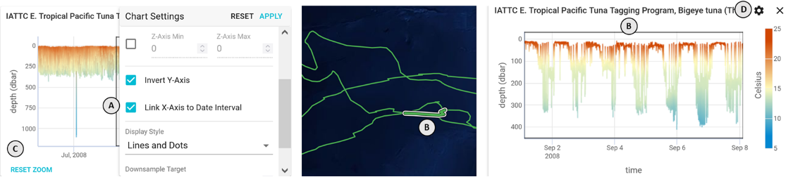

### How do I change a charted series symbol display styles?

Click on the **gear** icon **(A)** in the upper right corner of a chart to open the chart settings. Use the **Display Style** dropdown **(B)** to select one of the available style options: _Lines and Dots_ (default), _Dots Only_, and _Bars_. Once a selection has been made, click **APPLY** in the upper right corner **(D)** for the changes to take effect or **RESET** to revert to default settings.

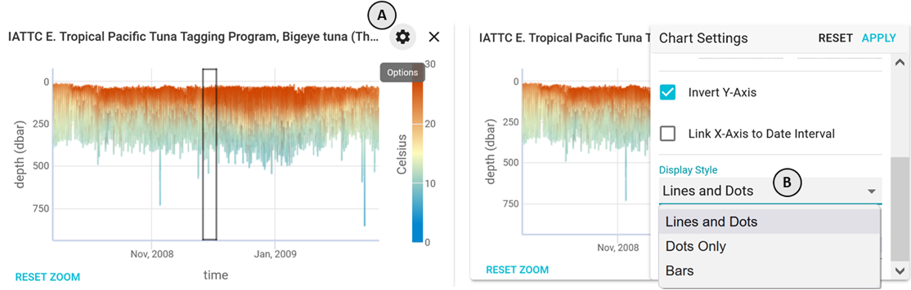

_Lines and Dots_ shows a connecting line between each data point which is rendered as a dot at low enough point densities. The _Dots Only_ option results in just the plotting of the data points, whereas _Bars_ will yield a bar-type plot useful for charting frequency distribution data as histograms. The default _Lines and Dots_ option should satisfy most uses. Use of the _Dots Only_ option is best, for example, in cases involving discrete vertical profiles **(A)** or when creating plots to identify correlations between variables **(B)**.

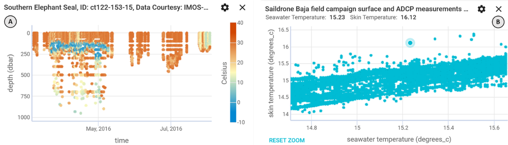

### How can I sync my view between the map and the charts?

Both the map and charts share the concept of the _selected date_ and _selected date range_. Both of these values are indicated in the date picker in the lower left of the application **(A)**.

For an in-situ dataset that is displayed on the map, the data points that fall within the selected date range will be highlighted with a white/black border **(B)**. Clicking on any point in that dataset on the map will switch the selected date to that data point's time. Similarly, in each chart that uses **Time** for the x-axis, a black bordered box will be displayed on the chart indicating this date range **(C)**. If it does not appear on the chart then the currently selected date range is outside of the chart's time display bounds. If it appears to simply be a vertical line, then the chart is zoomed out to far to distinguish the bounds of the box, try zooming in on the box to see it more clearly.

Clicking anywhere on a chart that uses **Time** for the x-axis will switch the selected date to the time that was clicked.

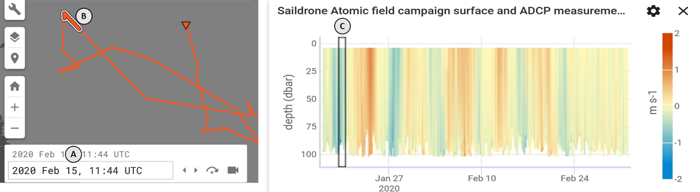

