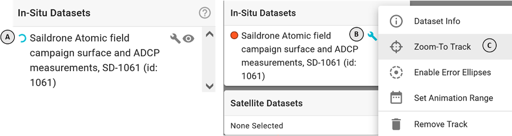
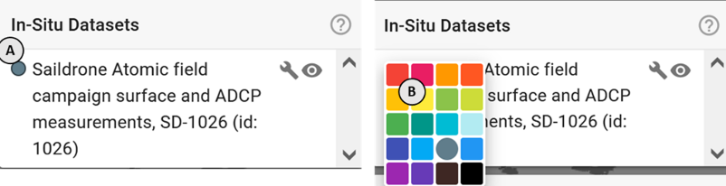
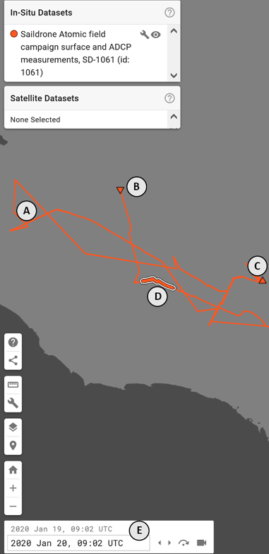
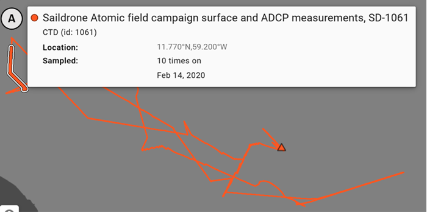
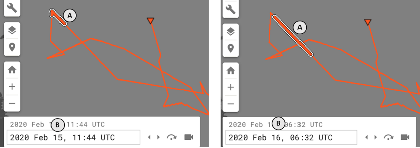
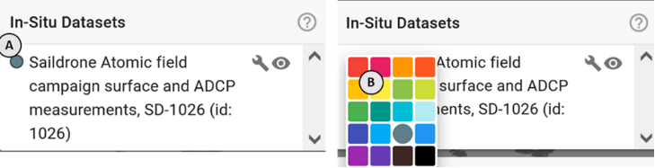
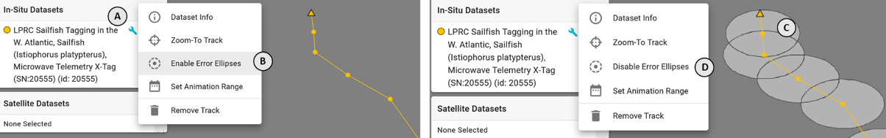
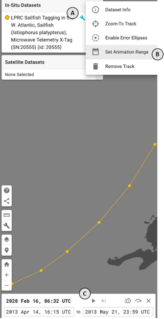

### Where is the in-situ dataset I just turned on?

_Some things to check are are:_

1. The dataset may still loading, this is indicated by a spinning icon **(A)** next to the dataset item in the **In-Situ Datasets** menu in the top left of the application.
2. If the dataset is loaded, it may be in a different area of the map. To focus on that dataset:
    - In the **In-Situ Datasets** menu, click on the wrench icon **(B)** to open additional view tools for that dataset
    - Click on **Zoom-To Track** **(C)**

3. The dataset is colored in such a way as to blend in with the base layer
    - In the **In-Situ Datasets** menu, find the colored dot to left of the dataset label **(A)**
    - Click on the dot and select an alternate color from the palette **(B)** that contrasts with the background

### How can I interact with the in-situ data on the map?

There are a few ways to examine the in-situ data on the map.

1. Simply looking at a track representing the in-situ dataset will show the spatial bounds over the entire sampling period, with each point connected by a line **(A)** indicating the temporal ordering of the points. The first measurement location will be indicated with a downward pointing triangle **(B)** and the final measurement location will be indicated with an upward pointing triangle **(C)**. If any point or section of the track is highlighted with a thicker white boarder **(D)**, that indicates that that section of the data falls within the _selected date range_ of the application **(E)**. Thus, as you change the _selected date_ you can watch the progression of the data sampling.

2. By hovering your cursor over a point in the dataset, a popover **(A)** will appear that describes that data point. It will list the dataset title, the lat/lon coordinates, and the number of times and dates that location was sampled in the dataset.

3. By clicking on a point in the dataset **(A)**, you will set the _selected date_ **(B)** to the date that that point was first sampled on and highlighted section of the track will be moved accordingly to the location of that date range.

### Can I change the color of the track?

Yes, in the upper left corner of the application you will see the **In-Situ Datasets** menu for active in-situ datasets. Just to the left of the dataset's title you will see a little dot **(A)** indicating the dataset's current render color. Click on the dot to open a small menu of color options **(B)**. Click on any of the color options to render the dataset with that color.

### What is the spatial error on the in-situ datasets?

It varies by dataset. Some datasets include a corollary spatial product that visualizes the lat/lon error bounds for each measurement location. To enable it, click on the **wrench** icon **(A)** next to the dataset's title in the **In-Situ Datasets** menu in the upper left corner of the application. Then click on **Enable Error Ellipses** **(B)**. If the dataset includes that corollary product, it will be displayed on the map **(C)**. If it does not, then nothing will change. To remove the positional error envelopes around the points, select **Disable Error Ellipses** from the menu **(D)**

### Can I automatically step through the spatial sampling within an in-situ dataset?

Yes, click on the **wrench** icon **(A)** next to the dataset's title in the **In-Situ Datasets** menu in the upper left corner of the application. Then click on **Set Animation Range** **(B)**. This will open the **animation controls** **(C)** in the lower left of the application and pre-set the start and end time of the animation range to the first and last sampled time from the in-situ dataset. Then you can pres the **play** icon to begin stepping through the date range.

_Learn more about animating under the **Time and Animation** section_
