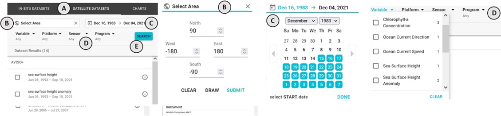
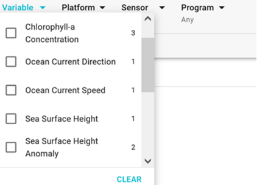
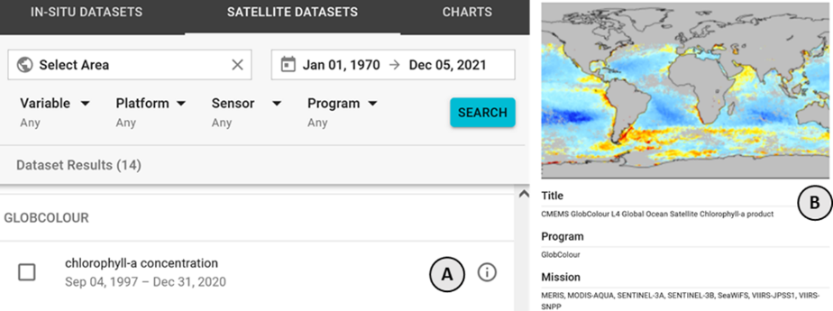

### How do I search for a particular dataset or filter out ones I don't want?

_In either the **IN-SITU DATASETS** or **SATELLITE DATASETS** **(A)** you can do the following:_

1. Use the **Select Area** input **(B)** to specify an area of interest
2. Use the date range input **(C)** to specify a time span
3. Select one or more parameter from **Variable**, **Platform**, **Sensor**, and **Program** **(D)**
4. Once you have made your selections, press the **SEARCH** button **(E)**
5. The list of results will be filtered according to your selections

### Why does one or more of the dropdowns show few, if any, options?

The dropdowns list values from the currently matched set of satellite datasets. They are meant to provide the ability to filter the current list but not to find additional matching items.

If a dropdown shows few options, that means that among the current set of matched datasets, there are few (if any) different values for that option. To get more, try removing one or more of the other filter options.

### How can I see more information about a dataset?

Click on the **info** icon **(A)** on the right side of the item. This will open a modal **(B)** that will display all of the available information for that dataset.

