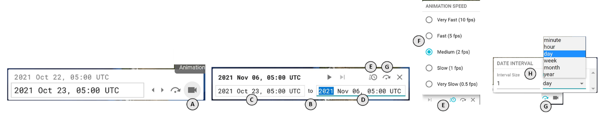

### How can I animate the data on the map?

Click on the **video camera** icon **(A)** on the far right of the _current date selector_ (in the lower left corner of the application). This will open the _animation controls_ **(B)** which you should fill in as follows (note all steps are optional):

1. Use the date inputs to enter a start time **(C)** and end time **(D)** for the animation to loop through.
2. Click on the **timer** icon **(E)** to open a popover where you can set the speed of the animation **(F)**
3. Click on the **skip** icon to open a popover **(G)** where you can set the size of each animation step **(H)**

Once you have made your selections, click the **play** icon in the upper middle of the _animation controls_ to begin playing the animation.

### How can I tell the current time step in an animation?

In the top left corner of the _animation controls_ you will see the current date displayed. This date will update with each animation step.

### How long of an animation can I play?

You can set as wide of a range as you like. Note that you may experience loading periods while the animation buffers satellite layers.
