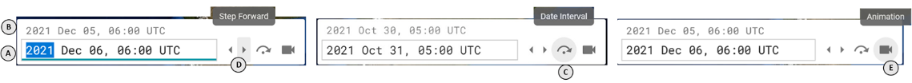
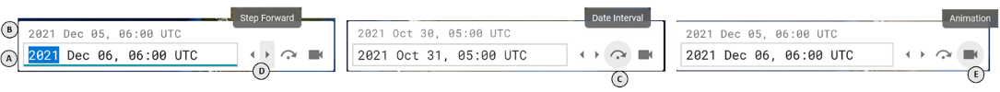
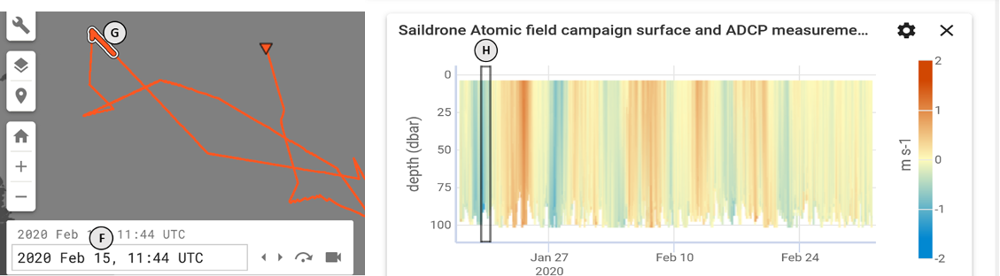
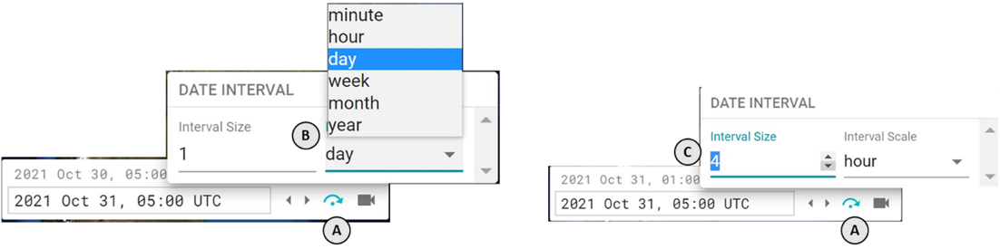
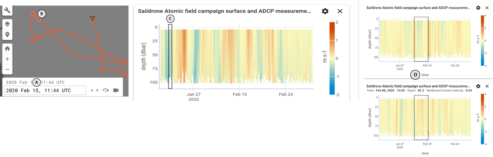

### What date and time am I looking at?

In the lower left corner of the application is the _current date selector_. This provides controls for adjusting the current step **(A, D)**, the time step interval **(C)**, and opening the _animation control panel_ **(E)**.

The primary input value indicates the _current selected date_ **(A)** for the application. The satellite data on the map corresponds to this date.

Above the _current selected date_ in light grey is the _current start date_ **(B)**, the time between the _current start date_ and the _current selected date_ is the _current date interval_ which can be adjusted by clicking on the **skip** icon **(C)**.

In-situ data points that are within the _current date interval_ **(A, F)** will be highlighted on their tracks as a bold line segment with a black and white border **(G)**. Charts that use **Time** for the their horizontal axis will also display a black box **(H)** around the data points that are within the _current date interval_.

### How do I change the date?

There are a few options:

1. Use the _current selected date_ input to enter a desired time **(A)**. Press enter when finished or click outside of the input to set the date
2. Next the _current selected date_ input are **arrow** icons **(D)**: use the left icon to step back one time step and the right to step forward one time step
3. Clicking on a data point of an in-situ dataset on the map **(G)** will set the _current selected date_ to that data point's timestamp **(F)**
4. Clicking on a data point of a chart that uses **Time** for the horizontal axis **(H)** will set the _current selected date_ **(F)** to that data point's timestamp

### What is the current time step and how can I change it?

The _current time step_ is the duration of the _current date interval_ (i.e. 1 day, 3 weeks, etc). By examining the _current date interval_ you can derive the _current date interval_. You can also click on the **skip** icon **(A)** in the _current date selector_ to open the _current date interval selector_. You can then use the inputs to set your desired interval time scale **(B)** and interval size **(C)**

Once the _current date interval_ is set, the **arrow** icons in the _current date selector_ will step the _current data and time_ by the magnitude of the _current date interval_.

### How can I sync my view between the map and the charts?

Both the map and charts share the concept of the _current selected date_ and _current date interval_. Both of these values are indicated in the date picker in the lower left of the application (A).

For an in-situ dataset that is displayed on the map, the data points that fall within the selected date range will be highlighted with a white/black border **(B)**. Clicking on any point in that dataset on the map will switch the selected date to that data point's time. Similarly, in each chart that uses **Time** for the x-axis, a black bordered box will be displayed on the chart indicating this date range **(C)**. If it does not appear on the chart then the currently selected date range is outside of the chart's time display bounds. If it appears to simply be a vertical line, then the chart is zoomed out to far to distinguish the bounds of the box, try zooming in on the box to see it more clearly. The extent of both the current step line segment and chart current step black border box will depend on the selected time interval extent in the Date Picker and Time Interval selector control tool **(A)**.

Clicking anywhere on a chart that uses **Time** for the x-axis will switch the selected date to the time that was clicked. If there are multiple time-series type charts, then changes to the current time step either via the map or by zooming within a chart will result in synchronous updates of the current time black bordered box to all available charts **(D)**.

