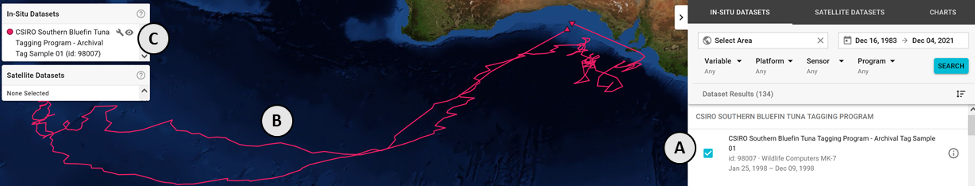
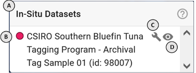
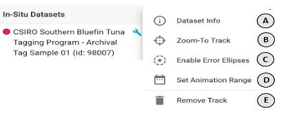

### How do I use this in-situ datasets menu?

First: for this menu **(C)** to be populated, you must select one or more insitu datasets from the **IN-SITU DATASET** search panel **(A)** on the right side of the application for display **(B)**

The **In-Situ Datasets** menu provides controls for viewing selected in-situ datasets on the map. Each item will display:
**A**: The color of the in-situ dataset on the map
**B**: The title of the dataset
**C**: A button to open a menu of controls
**D**: A toggle to hide the data layer on the map

To open the controls, click the **wrench** icon **(C)** next to the dataset title. There you will find:
**A**: A button to view metadata for that dataset
**B**: A button to pan/zoom the map over the dataset
**C**: A button to enable the error ellipses for the dataset (may not be available)
**D**: A button to open the _animation controls_ in the lower left of the application and pre-fill the start and end dates to the date range of the dataset
**E**: A button to deselect the dataset and remove it from the map

_Learn more about interacting with in-situ data on the map under the **Mapping** section_
