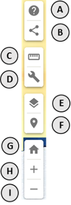
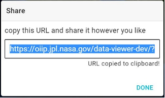
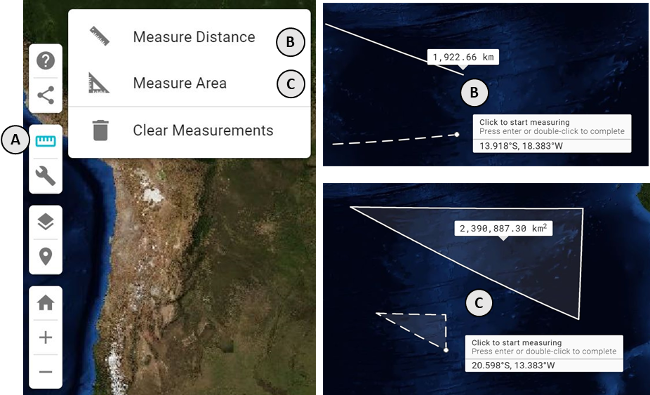
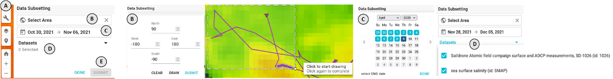
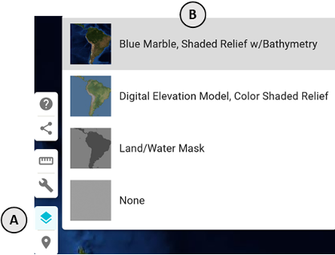
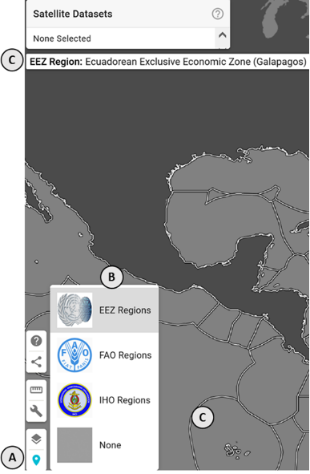

### What can I do with the map controls?

In the lower left side of the application, there are a set of floating buttons called the _map controls_. They provide additional options for manipulating the map display in the main center portion of the application.

Starting from the top:

**A**: The **help** icon will bring up this help modal with sections for how to use this application
**B**: The **share** icon will open a modal for generating a sharable url (see more below)
**C**: The **ruler** icon will display a selection of measurement tools (see more below)
**D**: The **wrench** icon will display additional tools related to data management (see more below)
**E**: The **layers** icon will display a list of basemaps you can select for the display
**F**: The **point of interest** icon will display a list area reference layers that can be added to the map display (see more below)
**G**: The **home** icon will reset the zoom/center of the map to the default position
**H**: The **plus** icon will zoom in the map display
**I**: the **minus** icon will zoom out the map display

### How do I use the share modal?

Click on the **share** icon to open the share modal. Click on the URL input value to copy it to your clipboard, or highlight the value and copy it directly.

Share the copied URL however you wish (email, social media, etc), when anyone clicks on the link the application will open with all of the current selections applied.

### How do I use the measurement tools?

Click on the **ruler** icon **(A)** to open the measurement menu and select either **distance** **(B)** or **area** **(C)** measurement. Once selected, click on the map to place your measurement points.

Double-click on a point to complete your measurement.

### How do I download data?

Click on the **wrench** icon **(A)** to open additional tools menu. Select **download data** to open the data download panel. Fill out your download selections and press **SUBMIT** to begin your download.

**B**: Specify the spatial subsetting area interactively by either entering bounding box extent values or drawing the area interactively on the map
**C**: Enter the subset start and end time via the calendar modal
**D**: Check on the datasets for inclusion. Listed options will be any Satellite and In-situ datasets selected previously via the Dataset Search panel.
**E**: Press SUBMIT to execute query and download the extracted data

Separate data files will be returned for each dataset selected. For in-situ, a Zip-file will be returned containing a CSV file with the data subset and a JSON file with associated metadata. Extracted satellite data will be in netCDF with the associated metadata embedded.

_NOTE: only in-situ data may be downloaded at this time_

### How do I change the basemap?

Click on the **layers** icon **(A)** to open the basemap menu. Select one of the available basemaps **(B)** by clicking on it. The default basemap is the Blue Marble with bathymetry.

### How do I use a reference layer?

Click on the **point of interest** icon **(A)** to open the reference layer menu. Select one of the available reference layers **(B)** by clicking on it. Once one is selected, as you move your mouse around the map the value of the reference layer under your mouse location will be displayed below the **Satellite Datasets** menu in the upper left of the application **(C)**.

