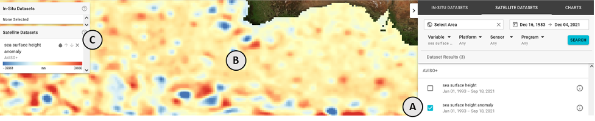
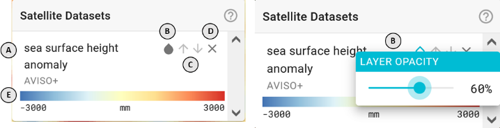
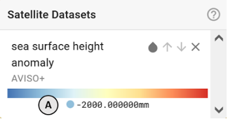

### How do I use this satellite datasets menu?

First: for this menu **(C)** to be populated, you must select one or more satellite datasets from the **SATELLITE DATASETS** search **(A)** on the right side of the application for display **(B)**

The **Satellite Datasets** menu provides controls for viewing selected satellite datasets on the map. Each item will display:

**A**: The dataset title
**B**: A **droplet** icon button that will open a slider to adjust the dataset's opacity
**C**: An **up** and **down** icon that will adjust the dataset's display order on the map
**D**: An **X** icon that will deselect the dataset and remove it from the map
**E**: A colorbar indicating the range of values displayed

### How do I know what value a certain color of this dataset corresponds to?

Hovering your mouse over the colorbar in the **Satellite Datasets** menu will display the approximate value **(E)** that each color represents.

_Learn more about interacting with satellite data on the map under the **Mapping** section_
