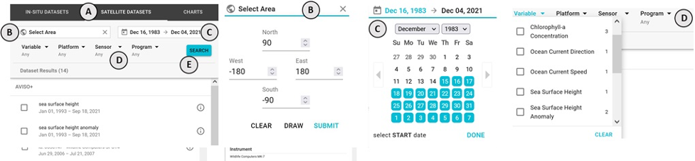
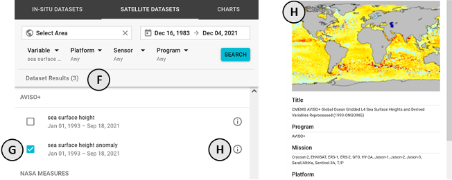

### How do I use the Satellite Datasets search tab?

The **SATELLITE DATASETS** menu **(A)** lets you search for, read about, and _select_ satellite datasets

1.  On the top of the tab are options for filtering the list of available satellite datasets
    -   Use the **Select Area** input **(B)** to specify (via input or drawing on the map) a bounding box for a particular area of interest
    -   Use the date range input **(C)** to specify a temporal range of interest
    -   Use the **Variable**, **Platform**, **Sensor**, and **Program** dropdowns **(D)** to select one or more parameter of interest
    -   Once you have made your filtering selections, press the **SEARCH** button **(E)** to apply your filtered search

2.  Below the search filters you will see a list of satellite datasets **(F)** that match your filter criteria
    -   Each dataset lists information regarding it's **Program**, **Platform**, and **Time Range**
    -   To see more information about a particular dataset, press the info icon on the right side of the dataset item **(H)**
    -   To _select_ a dataset, click on the title of the dataset item or on the checkbox to the left of the dataset title **(G)**
    -   Once a dataset is _selected_ it will display on the map and be available for charting

_Learn more by reading sections under **Search**, **Mapping**, and **Charting**_
